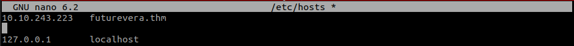

# Takeover

## Overview

Greetings everyone,

In this write-up, we will tackle PC from TryHackMe.

Machine link: [Takeover](https://tryhackme.com/room/takeover)

Difficulty Level: Easy

Let's Begin 🙌

Firstly, connect to the THM server using the OpenVPN configuration file generated by THM. [Click Here](https://tryhackme.com/r/access) to learn more about how to connect to VPN and access the boxes.

Once connected to the VPN service, click on "Start Machine" to access the machine's IP.

Upon joining the machine, you will be able to view the IP address of the target machine.

***

## Reconnaissance

### Rustscan

`rustscan -a 10.10.89.215`

<figure><figcaption></figcaption></figure>

### Results

The Target machine has three services running:

| Port | Service |
| ---- | ------- |
| 22   | SSH     |
| 80   | HTTP    |
| 443  | HTTPS   |

***

## Information Gathering - futurevera.thm

Add the Machines’s IP address to `/etc/hosts` file in your attack box with reference to `futurevera.thm` and save it.

<figure><figcaption></figcaption></figure>

Now lets check the HTTP website running on port 80. It was a simple landing page. Nothing interesting found.

<figure><figcaption></figcaption></figure>

***

## Enumeration - futurevera.thm

Next I started enumeration. I tried directory enumeration, but didn’t get anything.

### Subdomain Enumeration

So next I tried subdomain enumeration on the target.

I used `ffuf` for this task.


```bash
ffuf -u [http://futurevera.thm/](http://futurevera.thm/) -w /usr/share/wordlists/SecLists/Discovery/DNS/subdomains-top1million-20000.txt -H "HOST:FUZZ.futurevera.thm"
```


<figure><figcaption></figcaption></figure>

The result had a lots of `302` response. So this time I filtered out all the response with a status code `302` and ran the command again.


```bash
ffuf -u http://<target_ip>/ -w /usr/share/wordlists/SecLists/Discovery/DNS/subdomains-top1million-20000.txt -H "HOST:FUZZ.futurevera.thm" -fc 302
```


<figure><figcaption></figcaption></figure>

And this time found two subdomains. Now make sure to add these subdomains to the `/etc/hosts` file. You have to append the subdomains with the full url \[ Eg: `portal.futurevera.thm` ] to the previously add host separated by a space:

<figure><figcaption></figcaption></figure>


Remember to add all the subdomains to the `/etc/hosts` file to the respective IP address to access those subdomains.


Now I checked the `portal.futurevera.thm` subdomain.

<figure><figcaption></figcaption></figure>

It wasn’t accessible. So next I checked `payroll.futurevera.thm` subdomain.

<figure><figcaption></figcaption></figure>

That was also not accessible.

Now we can check the HTTPS website:

<figure><figcaption></figcaption></figure>

It resulted in the same landing page.

Next run `ffuf` on the HTTPS service to find the subdomains running via HTTPS.


```bash
ffuf -u https://<target_ip>/ -w /usr/share/wordlists/SecLists/Discovery/DNS/subdomains-top1million-20000.txt -H "HOST:FUZZ.futurevera.thm" -fc 302
```


<figure><figcaption></figcaption></figure>

Since all the request has a response with a status code of 200, our filter for code 302 didn’t work. So this time I tried to filter using size, since all the response sizes are `4605`.


```bash
ffuf -u https://<target_ip>/ -w /usr/share/wordlists/SecLists/Discovery/DNS/subdomains-top1million-20000.txt -H "HOST:FUZZ.futurevera.thm" -fs 4605
```


<figure><figcaption></figcaption></figure>

And found two new subdomains. Now append these subdomains to the `/etc/hosts` file.

<figure><figcaption></figcaption></figure>

Navigate to `https://blog.futurevera.thm/`.

<figure><figcaption></figcaption></figure>

Nothing serious found in this website.

Next I checked the `https://support.futurevera.thm/`

<figure><figcaption></figcaption></figure>

It has also nothing.

## Getting the Flag

So next I started to look for the certificates in all of the above subdomains.

You can view the certificate of a website as shown in the video below:



First I checked the certificate of `blog.futurevera.thm`. Didn’t found anything interesting.

Next I checked the certificate of `support.futurevera.thm`.

<figure><figcaption></figcaption></figure>

We can see that the value of `DNS Name` property is referring to `secrethelpdesk934752.support.futurevera.thm`.

Now append this domain to the `/etc/hosts` file.

<figure><figcaption></figcaption></figure>

If we navigate to `secrethelpdesk934752.support.futurevera.thm`, we can see a server not found error.

<figure><figcaption></figcaption></figure>

But if you take a look at the error, you can see the server url, which contains the flag.

We have successfully found the flag.

Thank You …..
